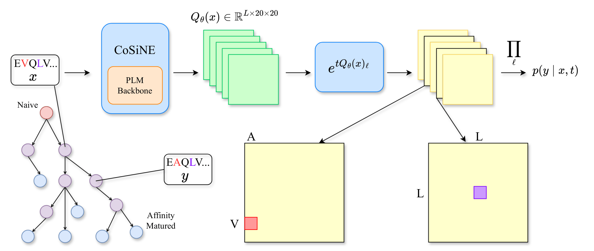

# CoSiNE: Neural Evolution of Antibodies

<p align="center">
  
</p>

Official implementation of [**CoSiNE**](https://arxiv.org/abs/2602.18982) (Conditionally Site-Independent Neural Evolution of Antibody Sequences), a framework for modeling antibody affinity maturation using neural continuous-time Markov chain.


## Key Features

CoSiNE can simulate antibody sequence affinity maturation and achieves strong performance in zero-shot variant effect prediction (VEP). With *Guided Gillespie* sampling, CoSiNE enables inference time steering of antibody properties using any plug-and-play predictor. This repository contains training scripts for CoSiNE as well as various inference time scripts for VEP and various sampling tasks.

- **Unconditional affinity maturation:** CoSiNE simulates realistic antibody evolutionary trajectories over long horizons, mapping from germline sequences to mature sequences through point mutations.
- **Guided Gillespie sampling:** CoSiNE supports plug-and-play predictor guidance which steers the properties of evolved sequences through any external differentiable oracle.
- **CDR/Fr optimization:** By constraining the sites under evolution, CoSiNE enables re-design of CDR or framework regions only.
- **Zero-shot VEP:** CoSiNE achieves exceptional performance on zero-shot variant effect prediction of antibody binding and expression assays. Our framework disentangles the effects of somatic hypermutation on observed affinity maturation rates, providing a selection score that strongly correlates with functional properties.


## Table of Contents
- [Installation](#installation)
- [Quick Start](#quick-start)
  - [Unconditional Sampling](#unconditional-sampling)
  - [Guided Gillespie Sampling](#guided-gillespie-sampling)
  - [CDR/Framework-Only Optimization](#cdrframework-only-optimization)
  - [Zero-Shot Variant Effect Prediction](#zero-shot-variant-effect-prediction)
- [Training](#training)
  - [Dataset](#dataset)
  - [Training From Scratch](#training-from-scratch)
- [Reproducing Paper Results](#reproducing-paper-results)
- [Citation](#citation)
- [Contact](#contact)
- [Acknowledgments](#acknowledgments)


## Installation

```bash
git clone https://github.com/thematrixmaster/cosine.git
cd cosine

# Pull the evo submodule
git submodule update --init

# We recommend using [uv](https://github.com/astral-sh/uv) for package management
uv venv --python 3.10
source .venv/bin/activate
uv sync
```


## Quick Start

Download the main model checkpoint trained on the DASM dataset from our paper.

```bash
mkdir -p checkpoints
hf download thematrixmaster/cosine cosine_dasm.ckpt --local-dir checkpoints
```


### Unconditional Sampling

To run unconditional (unguided) sampling with the downloaded CoSiNE checkpoint:

```bash
python scripts/guidance/cosine.py \
    --model-path checkpoints/cosine_model.ckpt \
    --seed-seq <starting-antibody-sequence> \
    --branch-length 2.0 \
    --batch-size 100 \
    --output-path results/mature.csv \
    --save-csv \
    --seed 42
```

**Key Parameters:**
- `--seed-seq`: Starting antibody sequence that you want to evolve.
- `--branch-length`: Amount of evolutionary time to simulate. Value is calibrated to the expected number of mutations per site.
- `--batch-size`: Number of sequences to sample.


### *Guided Gillespie* Sampling

As per our paper, our script performs guided sampling with SARS-CoV-1 or SARS-CoV-2 RBD binding predictors from [RefineGNN](https://github.com/wengong-jin/RefineGNN). To implement guidance with your own predictor, you can implement the `evo/oracles/base.py:GaussianOracle` class and add it as an option to the `evo/oracles/__init__.py:get_oracle` function.

```bash
python scripts/guidance/cosine.py \
    --model-path checkpoints/cosine_model.ckpt \
    --seed-seq <starting-antibody-sequence> \
    --branch-length 2.0 \
    --batch-size 100 \
    --oracle SARSCoV2Beta \
    --guidance-strength 2.0 \
    --use-guided \
    --output-path results/guided_mature.csv \
    --save-csv \
    --seed 42
```

**Key Parameters:**
- `--oracle`: Choice of oracle for guidance. Options include `SARSCoV2Beta`, `SARSCoV1`, or your custom oracle if implemented.
- `--guidance-strength`: Strength of guidance. Higher values steer more strongly towards sequences with better predicted properties.
- `--use-guided`: Flag to enable guided sampling. If not set, will perform unguided sampling.


### CDR/Framework-Only Optimization

To add contraints for site-specific optimization, you can specify a `--mask-region` flag with options among `CDR1, CDR2, CDR3, CDR_overall, FR1, FR2, FR3, FR4, FR_overall`. Additionally, you can set a maximum number of mutations with the `--max-mutations` flag. For example, to optimize only CDR3 with at most 5 mutations:

```bash
python scripts/guidance/cosine.py \
    --model-path checkpoints/cosine_model.ckpt \
    --seed-seq <starting-antibody-sequence> \
    --branch-length 2.0 \
    --batch-size 100 \
    --oracle SARSCoV2Beta \
    --guidance-strength 2.0 \
    --use-guided \
    --mask-region CDR3 \
    --max-mutations 5 \
    --output-path results/cdr3_optimized.csv \
    --save-csv \
    --seed 42
```


### Zero-Shot Variant Effect Prediction

We provide a `CosineDMSAnalyzer` class in `scripts/vep/cosine.py` for handling variant effect prediction (VEP) on deep mutational scanning (DMS) datasets. Given a csv file in the format of `scripts/vep/data_dms/binding/Koenig2017_g6_binding.csv`, you can run the `scripts/vep/cosine_antibody_vep.ipynb` notebook to calculate a selection score per mutant and evaluate the correlation of this score with the experimentally measured fitness values of your assay.


## Training

### Dataset

The primary dataset used for training is taken from the [DASM](https://elifesciences.org/reviewed-preprints/109644v1) paper. You can access it via the huggingface datasets library:

```bash
hf download --repo-type dataset thematrixmaster/cosine --local-dir data
```

### Training From Scratch
To train the CoSiNE model:

```bash
# Basic training with default settings
uv run python experiments/train_model.py experiment=train_ctmc_model_on_dasm

# Custom training parameters
uv run python experiments/train_model.py \
    experiment=train_ctmc_model_on_dasm \
    trainer.max_epochs=100 \
    model.optimizer.lr=0.0003
```

## Reproducing Paper Results

The majority of analyses reported in the paper were performed in the `notebooks/eval_ctmc_model.ipynb` notebook. This includes likelihood evaluations (Fig. 2), guided sampling consistency and antibody quality metrics (Fig. 5,6,S8), as well as some additional analyses in the Appendix on sampling error (Fig. S4) and per-site entropy (Fig. S5). Variant effect prediction results were obtained using the scripts in `scripts/vep/` with the main analysis in `scripts/vep/cosine_antibody_vep.ipynb`. Finally, the synthetic codon experiments were performed using the code in https://github.com/thematrixmaster/ctmc-experiments.

## Citation

If you use CoSiNE in your research, please consider citing our paper.

```bibtex
@article{Lu2026ConditionallySN,
  title={Conditionally Site-Independent Neural Evolution of Antibody Sequences},
  author={Stephen Zhewen Lu and Aakarsh Vermani and Kohei Sanno and Jiarui Lu and IV FrederickA.Matsen and Milind Jagota and Yun S. Song},
  journal={ArXiv},
  year={2026},
  url={https://api.semanticscholar.org/CorpusID:285973749}
}
```

## Contact

For questions or issues, please open a GitHub issue or contact:
- Stephen Z. Lu (stephen.lu@berkeley.edu)
- Aakarsh Vermani (aakarshv@berkeley.edu)

## Acknowledgments

This work builds on:
- [ESM](https://github.com/facebookresearch/esm): Protein language model used for backbone initialization
- [DASM](https://elifesciences.org/reviewed-preprints/109644v1): Processed dataset of antibody PCPs and main baseline for comparison
- [Thrifty](https://elifesciences.org/reviewed-preprints/105471v1): Model of somatic hypermutation used for selection score calculation
